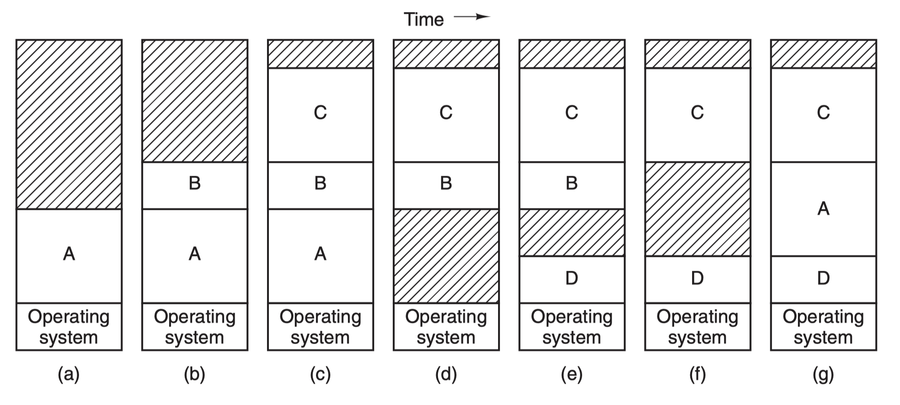
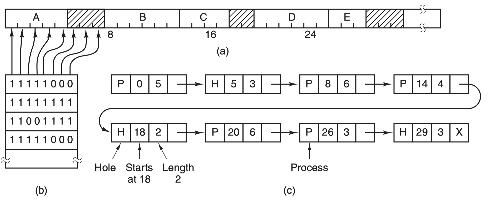
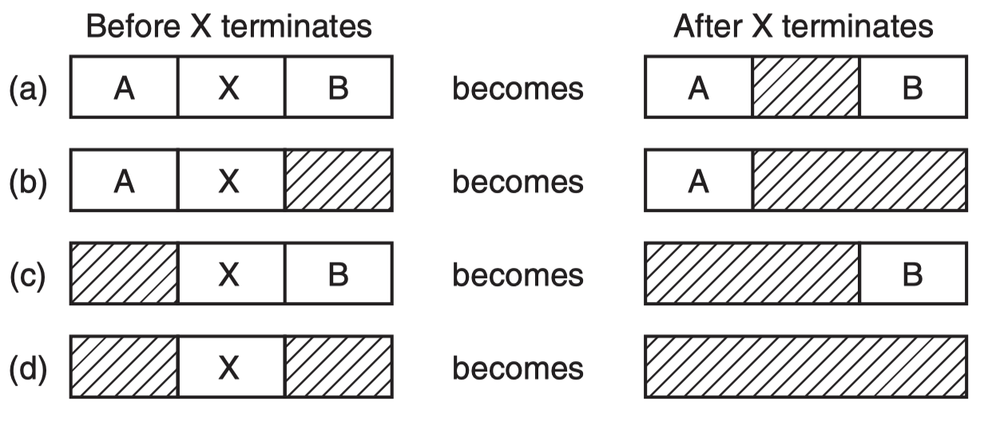

# 3.3. Memory Management

## Table of contents

## Notes 

### Moving up and down

- move data up to a higher level
  - fetch on demand (e.g. **demand paging**)
  - prefetch (read-ahead for I/O)
- when to evict data to a lower level
- simple paging? 
- demand paging? (the book puts simple paging and demand paging together)
- Segmentation? 

### Memory manager 

- the illusion that a process has all the memory to itself 
- MM implements address translation
  - converts virtual address (logical) to physical (real) address
  - ***virtual address***: expressed by the program
  - ***physical address***: actual memory used in hardware 
  - conversion happens every time memory is references 
  - **MMU (Memory Management Unit)** handles the conversion 
    - may be slow due to
      - addition/shift/masking (not too bad)
      - memory references (go to memory to access the mapping) (problematic)
        - solution: create cache translations using a TLB (translation lookaside buffer)

### Loading programs

- **<u>compiler</u>** and **<u>assembler</u>** (returns object module (almost runnable))
- **<u>linker</u>** (linking multiple object modules into one load module)
  - resolve external addresses and adjust relative addresses
- **<u>loader</u>**: load module into memory 

#### When is address translation performed? 

1. **At *writing time*** by the programmer (programmer specifies where things go, no longer done)
2. **At *compiler time* by a compiler** 
   1. compiler gives ***physical addresses*** <— we need to know when the compilation unit will be loaded
      1. when the compilation unit is loaded, it goes to the pre-specified loading location, and pushes off content originally at this location. 
   2. Done without a linker; rarely used (MS DOS .COM files)

3. **At *link-edit* time**
   1. Compiler:
      1.  generates ***relative*** (relocatable)
      2. references ***external*** addresses
   2. Linkage editor (at link-edit time)
      1. converts relocatable address [created by compiler] to absolute (relative address relocation)
      2. resolves external references
      3. These by implication requires the linker to know where the program will be loaded 
   3. Cons
      1. a program can only be loaded at where it is specified and cannot be moved 
      2. program cannot be split
      3. loader is trivial; hardware requirements minimal
4. **At *load* time**
   1. similar to link-edit time, **<u>without fixing the starting address</u>**
   2. program can be loaded anywhere
   3. program can be moved, but cannot be split
   4. hardware requirement: base/limit registers
   5. Loader sets the base/limit registers 
   6. no longer common
5. **At *execution* time [Current Solution]**
   1. translated dynamically during execution 
   2. progream <u>can be moved anywhere</u> and can be moved (primary drawback of link- or load-time translation)
   3. program is split into (fix sized) pieces
   4. hardware support for quick virtual to physical address translations
   5. the current model
6. what is the difference between dynamic loading and DLL (dynamic linking)? 
   1. you'd need to recompile for dynamic loading

### Memory abstraction 

- OS in RAM 
- OS in ROM — e.g. embedded systems (no need for flexibility)

#### No memory abstraction

- **monoprogramming** — with each request the OS copies the program from disk to memory -> execution 
- no address translation
- new program overrides the old one
- **overlays** are used when memory exceeds the size of physical memory
  - programs broken down to numerous chunks
  - main chunk (root) resides in memory and is called to load / unload various pieces 
  - programmer's responible to ensure a piece is loaded and called 
  - overlays now replaced by dynamic address translations and demand paging 
- using **swapping** (putting an process in and swapping out a process)
  - can support multiple processes to co-exist in physical memory (be careful since each program thinks it has the entire address space but it doesn't, and there's no layer of virtual address for protection)
- **Multiprogramming with fixed partitions [IBM: MFT (Multiprogramming with a Fixed number of Tasks)]** 
  - each partition is monoprogrammed; multiprogramming across partitions
  - <u>partition boundaries not movable</u> 
  - issue:
    - ***large internal fragmentation*** (waste space inside a memory region) because
      - each process is a single segment 
  - no sharing of memory beween processes
  - no dynamic address translation (done during load time)
    - loading should be dine carefully to prevent overriding prior processes
    - read book for more details on storage keys for protection 

#### Memory abstraction: address space

- creates an abstract memory for programs to live in 
- facilitates protection and reallocation of processes 

#### Base and limit registers

- base and limit registers used to give each process a separate address space 
  - require additional hardware; invisible to programmer 
  - simple version of dynamic reallocation 
- dynamic address translation (add base to relative address)

#### Swapping

- Multiprogramming with ***variable partitions*** **(MVP)** (as opposed to MFT's fixed partitions)
- Benefits:
  - No internal fragmentations (since the partition's size can change w/ process size)
  - The number and size of  partitions can change over time
- issues
  - **External fragmentation**: there'll be some space left over (between total memory space and sum(all process size)) (this is because a process is still stored as one piece in memory)
    - solution (Expensive): **memory compaction**: compact all current processes (by moving processes around) to have a contiguous free space
  - program loaded as a whole; process size can change with time  

#### Allocation algorithm for swapping

- **placement question**: which partition should we place the process when several partitions are big enough?
  - 
  - **First fit**: find the first hole that is big enough; break the hole into 2 pieces, one for the process, the other remain as a hole
  - **Next fit**: same as first fit, but next
  - **Best fit**: searches the entire memory to choose the smallest suitable hole (expensive)
  - **Worst fit**: searches the entire memory to choose the largest suitable hole (expensive)
  - **Quick fit**: interesting…see textbook

#### 3.2.3 Managing free memory

##### Bitmaps (see b)

- Memory is divided into N blocks; use 1 bit to indicate if that block is occupied / free. 
- Block size (how much memory space does 1 bit represent):
  - too big: internal fragmentation
  - too small: bitmap will be large

##### Free lists (see c)

- Each entry is either a hole or a process (occupied)
- Each entry needs to have 4 attributes
  - Hole / Process
  - Starting address
  - Length
  - Ptr to the next entry
- The linked list is kept in order of starting addresses (i.e. the first entry has starting address 0)
  - Maintaining the list in the same order as the memory makes updating the list easy (except for the head and the tail, an entry will have 2 neighbors and a maximum of 4 scenarios)
    - 

### Replacement

***Replacement***: which process should we swap out when we need to free up some memory? Up to now we have only discussed allocation algorithms (for swapping), but not eviction algorithms.

#### Paging

- **Pages**: divide program into fix-sized pieces
- **Page frames**: divide memory space into fix-sized pieces (the same as page size)

#### Non-demand paging

- No external fragmentation (since all pages fit perfectly with frames)
- Program is not (need not be) contiguous in memory
- To keep track of where the page is located on the memory (i.e. which frame), we need a **page table**, which in essence maintains a virtual-to-physical mapping
  - ***page number*** = virtual address / page size
  - ***offset*** = virtual address % page size
  - once we looked up the frame number with the page number:
    - ***physical address*** = frame number * frame size (i.e. page size) + offset

##### Properties of non-demand paging (without segmentation)

- the entire process must be in memory (no segmentation)
- physical address is not contiguous
- virtual address remains contiguous
- no external fragmentation
- has internal fragmentation:
  - on average, for each process, *internal fragmentation = 1/2 \* page size*. 

