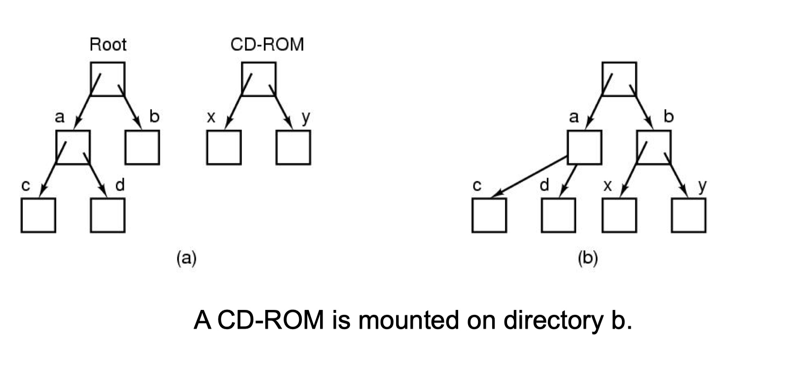
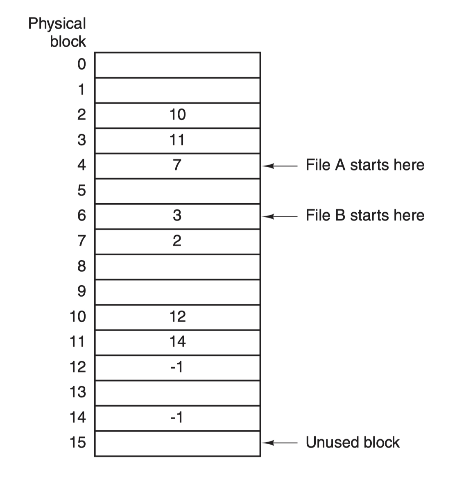
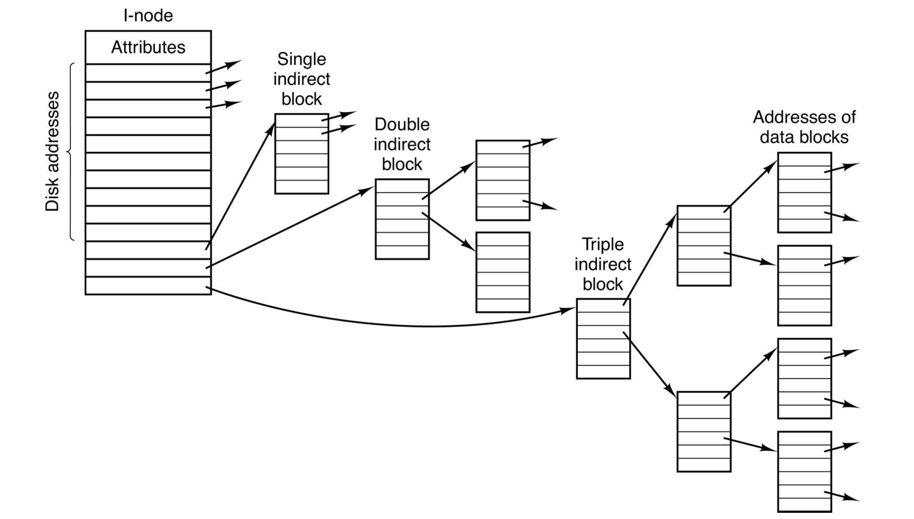

# Files 

## Table of contents

## Introduction to Files

### Requriements for files

1. size: allow large size
2. persistence: don't lose data
3. concurrent access: allow multiple processes to access the information concurrently

File is an abstraction mechanism (the hardware knows nothing).

- a way to store files on disk and access later

### Naming files

- uniform file name space that allow for persistence and concurrent access (avoid crashes)
- file name -> unique file (abs. or relative path)
  - think of fname as a unique id that _points to_ a piece of information 
    - file names can change, but their underlying information do not.

### File name extensions

- extensions are helpful to indicate something about the file
  - sometimes required by the OS (.exe for executable in Windows)
  - sometimes expected by certain programs (e.g. compiler)
  - default behavior (html -> browser)
  - convey meaning to humans (my.trips)
- In Unix you may have multiple file extensions (e.g. `file.html.zip`)

### File structure

theee common modes:

1. Byte streams
   - used by Unix, macOS, Windows
   - all OS sees is bytes, user program can put anything in the file and name as they want
   - minimum structure
   - maximum flexibility
2. A sequence of fixed-length records
   - each record comes with some internal structure 
   - _Read_ operation returns 1 record; _Write_ operation operates and appends one record
     - 80-character records for card images
     - 133-character records for line printer files
3. Tree of records 
   - each record contains a key field in a fixed positiohn which is used to quickly find a record

### File types

- Regular files: contains user info.
- Directories: system files for maintaining the structure of the file system
- Device files: 
  - Character special files: related to I/O and used to model serial I/O devices
  - Block special files: used to model disks
- Links: give a file additional names (links are different from shortcuts in Windows)

### Regular files (ASCII text)

- ASCII
- 7-bit characters
- Each line ends with End of Line (EOL) character
- Advantage:
  - can bve directly printed and edited with the text editor

### Binary files

- a stream of bytes
- consist of internal structure known to programs using them
- even though the file is just a sequence of bytes some structure can be imposed 
  - Will only be executed if it has a specific format

### File access

Two kinds of file access
1. Sequential access:
2. Random access: read bytes in any order
   - each access specifies which bytes are desired 
   - in Unix read/write is sequential; first you seek a byte (by specifying where you want to go); then you write

Note: in modern OSs all files support random access, although the OS will apply optimizations if it decides that it is probably being read sequentially.

File has attributes (creation time; key length; etc.)

### File operations (syscalls)

Create, delete, open, close, read, write, append, seek, get attributes, set attributes, rename

- **Create** (essential)
  - file is created with no data, sets some attributes (this operation can be merged with Open to avoid a separate system call)
- **Delete** (essential)
  - delete files to clear disk space
- **Open** (not essential)
  - translates a file name to the corresponding disk location; returns a **file descriptor** (akin to a file ID (handle); each opened file has a unique file descriptor) if the requestor has valid permissions
- **Close** (not essential)
  - frees table space used by attributes and addresses without waiting for process to terminate
- **Read** (essential)
  - need to specify:
    - location in the file
    - number of bytes to read
    - buffer into which data is placed (interesting)
- **Write** (essential)
  - data is written to file again usually to current position
    - current position == EOF -> file size increases
    - current position in the middle of the file -> existing data overwritten, lost forever
- **Append** (not seential)
  - restricted form of write, adds data at the end of the file
- **Seek** (not essential)
  - could be part of read/write
- **Get attributes** (essential)
  - Used by processes to make file attributes work (e.g. `make` requires files' latest modification time)
- **Set attributes** (maybe essential)
  - Essential if attributes are settable and can be changed after creation (e.g. modify protection attributes)
- **Rename**
  - copy-and-delete may not be possible for big files
  - copy-delete is not atomic

## Directories

### Mounting files in UNIX

Files can be mounted anywhere in UNIX.

### Syscalls for directories

- ***Create***
  - create new empty directory
  - `.` and `..` are automatically put into place
- ***delete***
  - only empty directories can be deleted.
- ***opendir***
  - similar to file open syscall
- ***closedir***
  - similar to file close syscall; free up resources before process termination
- ***readdir***
  - read the contents of a directory
- ***rename***
  - atomic operation; unlike the option of creating a new directory, moving the contents, then removing the old one
- ***link***
  - allow a file to appear in more than 1 directory
- ***unlink***
  - remove an entry in a directory
  - this is how a file is deleted
  - If a file is in multiple directories, only the link in the current directory is removed

## File System Implementation

### File System Layout

- a system usually has more than one disks
  - the first disk is the **boot disk**
  - Most disks are divided into **partitions** (varied in size) (i.e. logical disks)
  - one of the partitions is marked as the ***active*** partition
- **BIOS (Basic Input Output System)** reads the boot disk's first sector (Sector 0, aka **Master Boot Record (MBR)**) into memory
  - contains the partition table: each entry contains 1) the starting point, and 2) the length of the partition (akin to a STE)
  - contains the first-level loader
    - the 1st level loader reads the first sector of the active partition (boot block, boot sector), which contains the 2nd level loader
    - the program in the boot block loads the OS residing in the same partition.

#### Contents of a partition

Partition has a file system.

- **superblock** contains key parameters about the file system (e.g. file system type; number of blocks in the file system)
- **free space management**: information about free blocks in the file systems (bitmap or list of pointers)
- **root directory**: location of the top directory
- **I-nodes**: data structure associated with each file
  - in UNIX, the root i-node is stored in a fixed location (or a ptr to the root i-node is stored in the superblock)
    - the root i-node points to the root directory
  - For i-node based systems, they're typically stored in a separate region in the partition
- **files and directories**: the remainder of the disk

### Implementing files

- **sector**: the smallest unit that can be read or written (normally 512 bytes)
- Disk cannot write/read single bytes
- **blocks**: the OS reads and writes in disk blocks
  - size of a block is a multiple of the sector size
  - Most common block size: 4kb and 8kb
- Files are composed of blocks

#### Contiguous allocation

- the simplest allocation scheme is to allocate a contiguous run of disk blocks
  - some space is wasted at the end of the last block (internal fragmentation)
- advantages:
  - simple to implement
  - excellent read performance
- disadvantages:
  - files grow and need to be moved: the disk will ultimately consist of files and holes (external fragmentation)
    - compaction is possible but very expensive
- used in non-writeable systems such as CD-ROMs.

#### Linked list allocation

- use a linked-list of blocks
- the directory stores the first block. Each block contains a ptr to the next block. The last block contains EOF.
- Benefit:
  - No external fragmentation; some internal fragmentation
  - straightforward sequential read
- Cost: 
  - Terrible random-access performance
- Not used in practice

#### The File Allocation Table system (FAT)

- files still consist of a linked list of blocks, but the links are now stored in a table (FAT)
- random news is dramatically faster; all pointers are now stored in memory, so no need for many disk references when random accessing
- The directory only keeps track of the first block's number
- Each entry stores the next block; `-1` denotes the ending of a file
  - 
  - File 1 uses block 4 7 2 10 12
  - File 2 uses block 6 3 11 14
- ***Disadvantage***: the entire table must be in memory for this system to work. 

#### I-node based File System

- Each file and directory has an i-node
- root i-node is at a known location on disk accessible by the OS

- **Organization**
  - the i-node itself points to the first n blocks of the file (***direct blocks***)
  - if size > n: 
    - ***single indirect block*** points to K disk blocks ( `k = block size / ptr size`)
  - if single indirect block does not cover: 
    - ***double indirect block*** points to K single indirect blocks, each pointing to K blocks
  - ***triple indirect blocks*** point to K doube indirect blocks, K^2 single indirect blocks, K^3 data blocks

### Implementing directories

- directory: maps file name to info. required to retrieve the underlying data (aka the file)
  - continuous allocated file: store file starting address on disk; file size
  - linked-list allocation: *points to* the first block of the file
  - i-node based system: *points to* the i-node of the file
- **file attributes**
  - can be stored at the directory (windows)
  - can be stored in the i-node (unix)
- **search files**
  - in small directories: check one by one
  - in large directories: hashing, B-trees

### Shared (multinamed) files (hardlinks & symlinks)

#### HardLinks

- multiple names for the same file has an <u>equal status</u>
- filenames point to another i-node (not a new i-node associated with a new file).
- Hard links can be created only for regular files, not directories.
- If the underlying file is removed, the hardlink still points to the same file (and is still accessbile, but not accessible in its original directory)
- If a file with the same name is created in the original file, the hardlink does not point to the new file; it still points to the old file (and can still modify it). Essentially, we have two files with the same name running in parallel.

#### SymLinks

- Create a new file for symlink (not a regular file), which entails a new i-node
  - the new file contains the ***name*** of the original file
- if the underlying file is ***removed***, the symlink becomes invalid
- if the underlying file is ***replaced*** (first removed then added a new file with the same name) with a new file, the symlink refers to the new file
- Removing the symlink has no effect on the underlying file
- SymLink allows linking to a directory (while hardlink does not allow this)
  - If `A/SymLink` points to directory `B/`, and file `B/y` exists, then `A/SymLink/y` is equivalent to accessing `B/y`.
