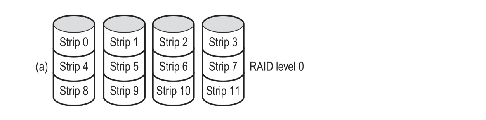

# 5.1 I/O Devices

## Table of contents

## Intro

Each IO device has a limit on data rate (e.g. 56K modem: 7kb/sec).

I/O usually requires a mechanical and an electronic component.

- _Mechanical component_: the **device** itself
- _Electronic component_: the **device controller** (from the OS's perspective this is the device)
  - Controllers can handle a couple identical devices

How the driver talks with the device controller?

- Each controller has a few registers for communicating with the CPU
- Mapped IO
  - maps all the cotnrol registers into the memory space
    - each control register is assigned unique memory address to which no memory is assignec
  - the OS uses `load` and `store` instructions to read and write the registers

How does the controller talk with the disk?

- **Without DMA** (with programmed I/O (PIO)) the controller reads the block from the drive serially, bit by bit, until the entire block is in the internal buffer
  - the controller then causes an interrupt, notifying the OS....

- **With DMA**:
  - benefit: only interrupt the OS once

- **Direct Memory Access (DMA) _Special hardware_**
  - while DMA saves CPU work, the number of references to central memory remains the same
  - Main memory can still be a bottleneck
  - However, communications on the bus is dramatically reduced (which is good)

| IO Approaches              | Benefit                                                         | Costs                                                   |
| -------------------------- | --------------------------------------------------------------- | ------------------------------------------------------- |
| Programmed I/O             | Easiest to implement; busy-waiting is fine for embedded systems | CPU is tied up                                          |
| Interrupt-driven I/O       | More efficient CPU usage than programmed IO                     | Inefficient to interrupt frequently; some CPU is wasted |
| DMA (Direct Memory Access) | Only one interrupt needed                                       | DMA controller is much slower CPU                       |

### Software side

Goals:

_**Device indepencence**_

- write programs that can access any I/O device without specifying the device in advance
- the OS _does_ take care of the differences among devices (which may require different command sequences)

_**File names should be device-independent**_

_**Buffering**_

- data must be put into an output buffer in advance to decouple th erate at which the buffer is filled from the rate at which it is emptied
- expensive (extensive copying; major impact on I/O performance

_**Shareable vs. dedicated device**_

- Shareable: e.g. disk
- Dedicated: e.g. CD-ROM

## Layers

### Device-independent OS software 

- drivers have the same interface between it and the OS
- OS defines the set of functions the driver must supply

#### Naming

- Major device number —> locate the appropriate driver
- Minor device number —> for which device the request is intended (a driver can support multiple devices)

#### Protection 

- Prevent users from accessing devices they're not allowed to access
- For both unix and windows:
  - devices appear in the file as *named objects*
  - Unix uses the `rwx` bits on files; the sam eprotection rules for files
- Up to the system admin to set the proper permissions

#### Buffering

- harmonizes the speed at which user accesses and the speed at which the driver supplies data

#### Library routines

- system calls are normally made by library procedures `e.g. count = read(fd, buffer, nbytes)`

#### Utilities and Daemons

- Deamon and spooling are used to deal w/ dedicated IO devices (e.g. printer)
- Deamon has the exclusive permission to use the device
- Data copied to a spooling directory; once finished, daemon writes back to the device

## Disks

### Disk hardware

#### Magnetic disks

- RPM
- Tracks per surface
- Sectors per track (bit density)
- Tracks per cylinder
- Seek time: the time required to seek the desired cylinder
  - overlapping seek
- Rotational latency
- Transfer rate: the rate at which data flow between drive and computer 

#### Redundant Array of Inexpensive/Independent Disks (RAID)

- a box full of disks as a single drive
- RAID looks like a **Single Large Expensive Disk (SLED)** to the OS
- RAID has different configurations (0-6 level)

##### Level 0: Striping

- benefit: great throughput
- downside: no redundancy

##### Level 1: Mirroring

- True RAID: duplicate all the disks
- on write: every strip is written twice (worse performance)
- on read: either copy can be used (helps w/ distributing the load over more drives, up to twice as good)
- great fault tolerance

##### Parity and XOR

- Parity helps check whether something goes wrong (e.g. if the data is corrupt)
- A XOR B = C ==> A = C XOR B and ...

##### Level 2: synchronized disks, bit interleaving, multiple hamming checksums disks

- not used anymore 

##### Level 3: Synchronized disks, bit interleaved, single parity disk (simplified L2)

##### Level 4: Stripping + Parity Disk

- if one of the disks go down, it can be recovered by the parity disk (PD) ad the rest of the disks
- performs poorly for small updates (small update; but requires to compute XOR value)

##### Level 5: Rotated parity

- goal: avoid bottleneck at the single parity disk b/c the parity disk is needed for every write operation
  - the parity bits distributed uniformly over all the drives (like round-robin)
- downside: if drive crashes, reconstructing is difficult

##### Level 6: Level 5 w/ an additional parity block

- an additional parity block is used
- data is stripped across the disk with two parity blocks
- writes are more expensive b/c of parity calculations
- reads have no performance penalty
- more reliability

### Disk Arm Scheduling Algorithms

- **seek time** (time to move to the proper cylinder)
- **rotational delay** (how long for the proper sector to come under the read-write head)
- actual data transfer time (fast)

DASA aim at reducing mean seek time (seek time and rotational delay are the two main factors). 

#### FCFS

- the disk driver accepts requests one at a time
  - advantage:
    - fair; no staravtion
  - Disadvantage:
    - seek time not optimized

#### Pick

- Same as FCFS but picks up requests for cylincers that are "on the way" to the *next* FCFS request.

#### SSTF or SSF (Shortest Seek Time First)

- Use the greedy algorithm to handle th eclosest next request to minimize seek time
- trades off minimizing seek time with fairness
  - Conceivably the arm can stay in one region for a long time (starving requests)
  - cylinders in the middle receive better service

#### Elevator

##### Scan

- one bit representing the current direction: UP or DOWN
- the arm moves in that direction and handles requests in one direction until reaching the end of the disk; this is when the direction is reversed
- still favors requests in the middle but doesn't starve requests

##### Look

- the arm moves in one direction until there's <u>no pending requests in that direction</u>; then the direction is reversed.

#### N-step Scan

- disk requests are serviced in batches
- each batch processed using the Elevator Scan algorithm
- while the disk is servicing a scan direction, the controller gathers new requests and sorts them
- at the end of the current sweep, the new list becomes the current sweep

#### Circular Elevator

- go in one direction (UP or DOWN), once finished in one direction, start from the bottom. 
  - e.g. 12 16 34 36 1 8

### Track caching

- seek and rotational delays dominate the performance, so reading one or two sectors at one time is very inefficient
  - disk controllers cache multiple sectors (significant portions of the entire track)
  - whlie in rotational delays, the controller cache the sectors passed through on the way
  - this is completely independent of the OS cache

### Error handling

- bad sectors: do not correctly read back the value written to them
- two approaches:
  - deal w/ errors in the controller
    - substitute bad sectors w/ one of the spares
    - controller keeps track of the bad sectors
  - deal w/ errors in the OS
    - the OS remaps in software if the controller cannot do so

## Clock

- Processes use either a separate timer or uses the system clock to update its running time
  - Less accurate: when there’s an interrupt, the process is not *actually* running but it is counted in the timer.

## Keyboard

- a keyboard comes with an embedded microprocessor that communciates with the keyboard controller
- an interrupt is generated when a key is struck and another generated when released
  - up to the keyboard driver to keep track of each key's status (UP or DOWN)
- Each time a key is pressed a *scan code* is put into an IO register 
- driver determines upper, lower case and key combinations based on information from keyboard

## Mouse

- Hardware is only responsible for sending `delta_x, delta_y` and `btn_status`
- "double click" is implemented by the software